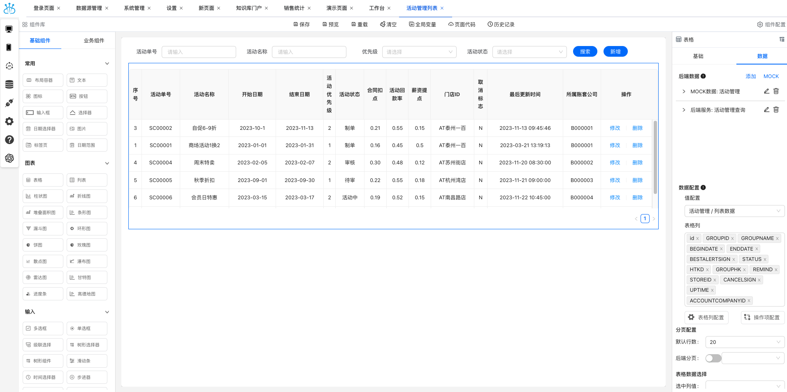
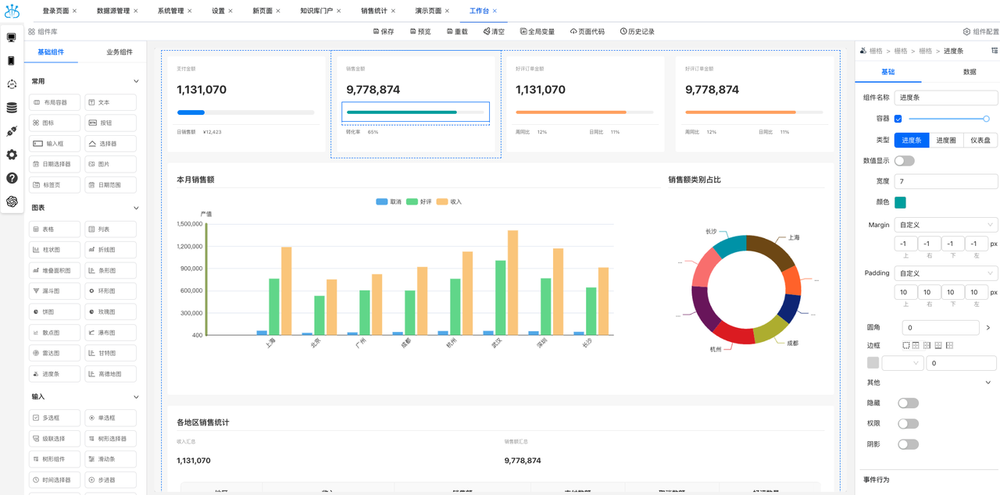
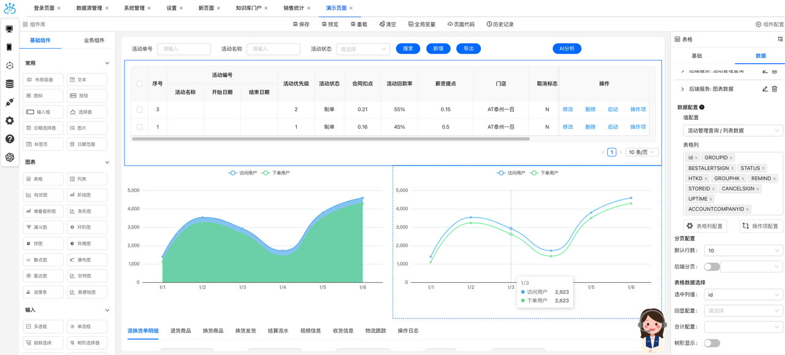
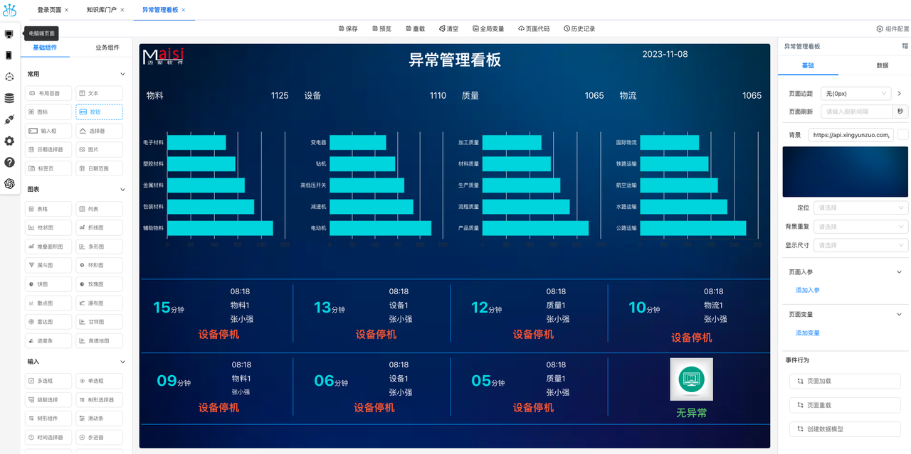
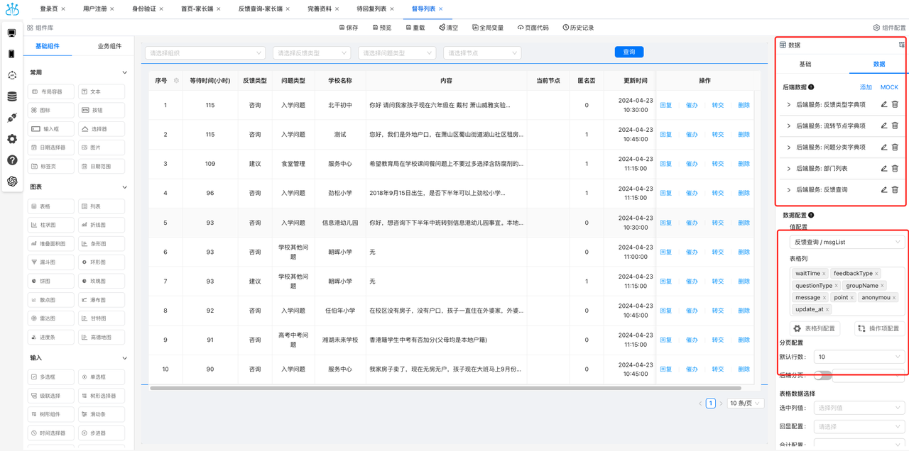
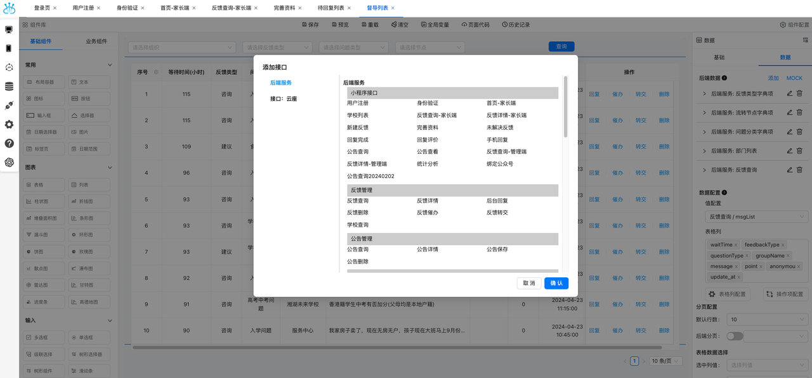
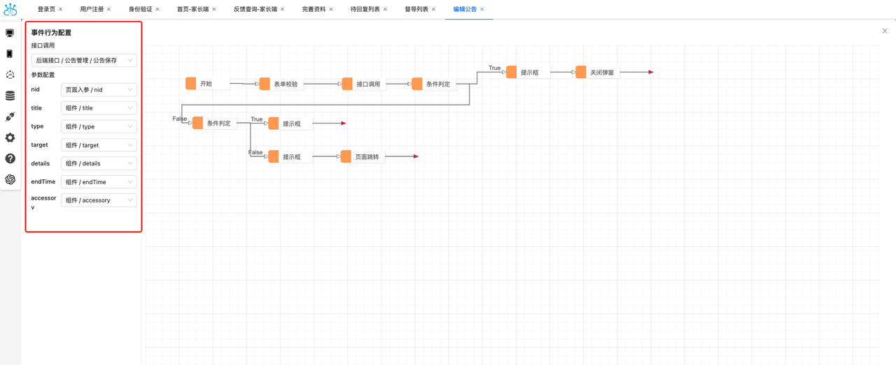
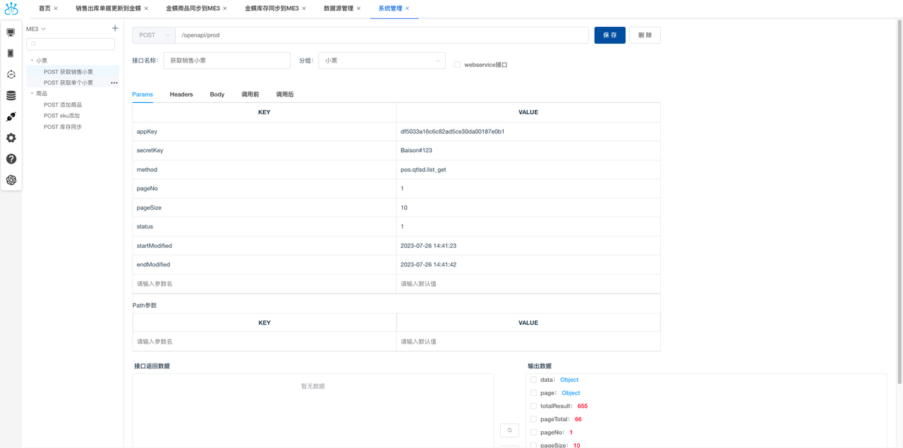
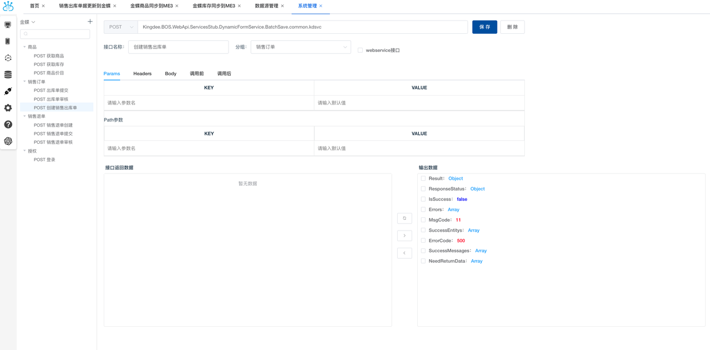
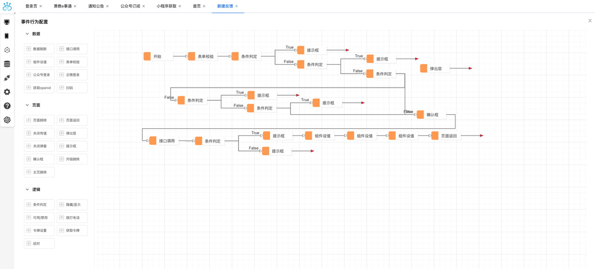

<p align="center">
	
</p>
<p align="center">
	<a href="https://gitee.com/Nebula-lowcode/nebulalowcode"></a>
    <a href="https://gitee.com/Nebula-lowcode/nebulalowcode/blob/master/LICENSE"></a>
</p>

## 平台简介
星云座是一款致力于解决传统软件开发痛点的低代码平台，通过简化开发流程、降低技术门槛、加快项目交付速度等特点，为用户提供了高效、灵活和成本效益的应用开发解决方案


## 解决痛点
<strong>提高开发效率</strong> - 通过可视化建模和拖拽式开发，大幅减少编码工作量，提高团队开发效率

<strong>降低技术门槛</strong> - 将开发过程抽象化，非专业开发人员也能轻松参与应用开发，降低技术门槛

<strong>加快项目交付速度</strong> - 快速搭建原型并迅速迭代，缩短项目开发周期，加快项目交付速度

<strong>提高业务灵活性</strong> - 业务人员可以灵活参与应用开发和调整，及时响应市场需求变化，提高业务灵活性

<strong>降低开发成本</strong> - 减少编码工作量和开发周期，降低开发成本，提升项目的投资回报率

<strong>统一管理和维护</strong> - 提供统一的开发环境和管理工具，方便集中管理和维护应用，降低系统的维护成本和风险

## 在线体验

- [官网地址](https://www.xingyunzuo.cn?from=gitee)
- [Demo地址](https://demo.xingyunzuo.com?from=gitee)
- [Pro demo地址](https://test.xingyunzuo.com?from=gitee)
- [培训视频](https://www.bilibili.com/video/BV1Y1421B7bp/?spm_id_from=333.337.search-card.all.click&vd_source=88e98143bb8f9f941ea8b11e2c2bd157)

## 官方群聊

 [](http://qm.qq.com/cgi-bin/qm/qr?_wv=1027&k=t_NuJNDKNwp21V1Nz_EPVfBGab_fCcMM&authKey=1XBPqVjp2sraSpzuy8YT8RfBvsb9fqYsbnLcwuVPrxRk2SS89x2S5hWcjCdPt0WJ&noverify=0&group_code=768551975)

## 快速启动

### 依赖
| 插件 | 版本  | 用途 |
|--- |-----| ----- |
| node.js | ≥16.20.2 |  JavaScript运行环境 |

### 启动前端

```
npm install
```
```
npm run dev
```

## 功能

| 功能             | 开源版本        | Pro 版本            |
| :--------------  | :--------------: | :-----------------: |
| 组件事件         |       ✅         |         ✅           |
| 页面事件         |       ✅         |         ✅           |
| 页面预览         |       ✅         |         ✅           |
| 页面渲染         |       ✅         |         ✅           |
| 布局组件         |       ✅         |         ✅           |
| 输入组件         |       ✅         |         ✅           |
| 图表组件         |       ✅         |         ✅           |
| 页面入参         |       ✅         |         ✅           |
| 管理页面框架     |       ❌         |         ✅           |
| 全局变量         |       ❌         |         ✅           |
| 页面变量         |       ❌         |         ✅           |
| 自定义组件       |       ❌         |         ✅           |
| 脚本函数         |       ❌         |         ✅           |
| 业务组件         |       ❌         |         ✅           |
| 后端接口开发     |       ❌         |         ✅           |
| 数据库连接       |       ❌         |         ✅           |
| 外部接口对接     |       ❌         |         ✅           |
| 项目配置         |       ❌         |         ✅           |


## 演示图

<table>
	<tr>
        <td></td>
        <td></td>
    </tr>	 
    <tr>
        <td></td>
        <td></td>
    </tr>
    <tr>
        <td></td>
        <td></td>
    </tr>
    <tr>
        <td></td>
        <td></td>
    </tr>
    <tr>
        <td></td>
        <td></td>
    </tr>
</table>
